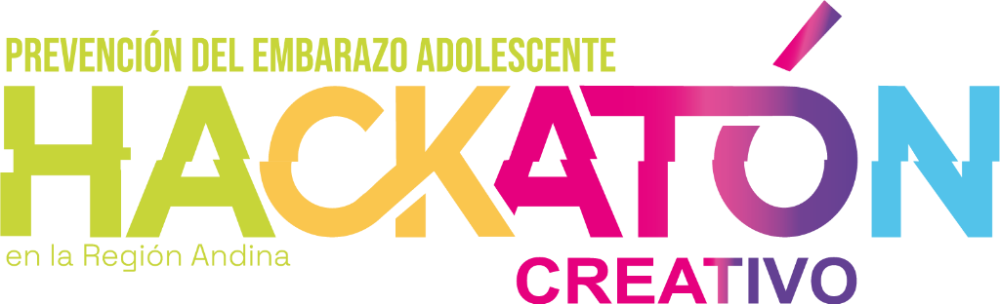

# 🇵🇪 Plataforma Regional de Incidencia Política y Diagnóstico Ejecutivo - Prevención de Violencias y Embarazo Infantil (PLANEA 2025-2030)

[](https://github.com/Stephano240508/HACKATHON)

Documento ejecutivo y herramienta interactiva de incidencia política para **Congresistas, Ministros, Ministerios de Economía y Finanzas, Ministerios de Salud y Gobiernos Regionales**, desarrollada en el marco de la **Hackatón Creativa Regional PLANEA 2025-2030**, avalada institucionalmente por:
- **MINSA** (Ministerio de Salud)
- **ORAS-CONHU** (Organismo Andino de Salud - Convenio Hipólito Unanue)
- **UNFPA** (Fondo de Población de las Naciones Unidas)
- **OPS/OMS** (Organización Panamericana de la Salud / Organización Mundial de la Salud)

---

## 🌟 Características Principales

1. **Diagnóstico Técnico y Evidencia Actuarial**: Datos clínicos, epidemiológicos y de infraestructura sobre embarazo infantil (<15 años) e indemnidad sexual en los 7 países andinos.
2. **Análisis Costo-Beneficio & Retorno Social de Inversión (ROI 7:1)**: Sustento económico demostrando un retorno de hasta USD 7.00 por cada dólar invertido en prevención según estudios MILENA del UNFPA.
3. **Explorador Interactivo de Indicadores Territoriales**: Filtro dinámico con tasas de fecundidad, cobertura de consultorios amigables y costo estimado de inacción territorial.
4. **Mitos vs. Evidencia Oficial (Fact-Checking)**: Módulo interactivo de contraargumentación con respaldo científico y marcos jurídicos vigentes.
5. **Cobertura Multilingüe Universal (16 Idiomas)**:
   - **Idiomas Globales**: Español, English.
   - **Lenguas Originarias Andinas e Indígenas**: Runasimi (Quechua), Aymar aru, Avañe'ẽ (Guaraní), Mapudungun, Kichwa, Wayuunaiki, Warao, Pemón, Nasa Yuwe, Emberá, Asháninka, Awajún, Shuar Chicham y Rapa Nui.
6. **Selector de Países Andinos**: Perú 🇵🇪, Bolivia 🇧🇴, Chile 🇨🇱, Colombia 🇨🇴, Ecuador 🇪🇨, Venezuela 🇻🇪 y Marco Regional Transversal.
7. **Diseño Accesible y Responsivo (Phone-Friendly)**: Adaptado para teléfonos móviles, tablets y computadoras de escritorio con soporte de Modo Oscuro 🌙 y Modo Claro ☀️ (WCAG 2.1 AAA).
8. **6 Ventanas Modales Ejecutivas**: Compendio científico, matrices PLANEA 2025-2030, guías globales AA-HA! y fichas técnicas legislativas.

---

## 🛠️ Arquitectura Técnica

- **Estructura**: HTML5 Semántico accesible con marcado ARIA (`sr-only-focusable`).
- **Diseño & Estilos**: Tailwind CSS + `styles.css` con variables CSS personalizadas y diseño glassmórfico de alto contraste.
- **Lógica Frontend**: JavaScript ES6+ modular (`app.js`) con matriz de datos por país, catálogo de 16 idiomas, gestor de temas y simulador territorial dinámico.

---

## 🚀 Cómo Ejecutar Localmente

1. Iniciar un servidor HTTP local en Node.js o Python:
   ```bash
   # Opción 1: Node.js (npx)
   npx serve .
   
   # Opción 2: Python
   python -m http.server 8899
   ```
2. Acceder en tu navegador web a:
   ```text
   http://localhost:8899
   ```

---

## 📁 Repositorio Oficial en GitHub y Despliegue

- **Repositorio Oficial:** [https://github.com/Stephano240508/HACKATHON](https://github.com/Stephano240508/HACKATHON)
- **Despliegue en la Web:** [https://black-delta.vercel.app](https://black-delta.vercel.app)
